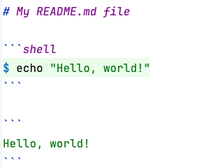

# MARKDOWN executor

A simple application that parses markdown files and executes the _shell_ code
blocks. Consider a markdown file, named `README.md`, with the following content:



By using the MARKDOWN executor application, you can execute all _shell_ code
blocks encapsulated by ` ```shell ` and ` ``` ` markers. To run the commands
from the `README.md` file in the current directory, execute:

```shell
$ me
```

This command will output the following.

```
Hello, world!
```

In this example we only have one _shell_ code block that simply prints
`Hello, world!`.

You can capture the output into file by redirecting both streams to the file.

```shell
$ me > output.txt 2>&1
```

The motivation behind this application is to verify that the examples provided
in the `README.md` documents work well (do not fail). This ensures that the
documentation (in the form of MARKDOWN) is still valid even after changes that
are made to the code base. Anyone following the steps provided by the
documentation should achieve the same results.

For additional options and usage instructions, you can access the help
documentation with:

```shell
$ me --help
```

## Development Guidelines

1. Build and test the application

   This application is developed with the
   [rust](https://www.rust-lang.org/tools/install) programming language, version
   `1.77.2`.

   ```shell
   $ cargo clean
   $ cargo fmt
   $ cargo clippy
   $ cargo build --release
   $ cargo test
   ```

2. Continuous delivery

   The MARKDOWN executor employs GitHub Actions for automated building and
   testing. Every push to the `main` branch triggers these actions, ensuring
   that the application remains stable and functional with each update.

   You can find all official releases
   [here](https://github.com/albertattard/me/releases). There is no need for
   special tags; simply push your changes to `main`, and GitHub Actions will
   handle the build and testing processes.

3. Install the MARKDOWN executor

   **The binary is compiled for Linux x86**.

   ```shell
   $ mkdir -p "${HOME}/.local/bin"
   $ curl \
     --silent \
     --location \
     --output "${HOME}/.local/bin/me" \
     'https://github.com/albertattard/me/releases/latest/download/me'
   $ chmod +x "${HOME}/.local/bin/me"
   ```

## Pending

1. Build it for all OSes, including macOS, Linux, and Windows.
